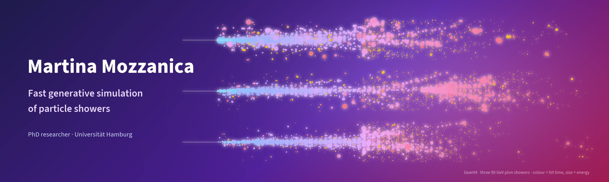

  

### Hi, I'm Martina 👋

I'm a PhD student at **Universität Hamburg** working on **fast simulation of particle showers with deep generative models**: diffusion, flow matching and one-step generators for hadronic showers in highly granular calorimeters, as point clouds with energy and time.

[Website](https://mmozzanica5.github.io) ·
[INSPIRE](https://inspirehep.net/literature?q=a%20Mozzanica%2C%20Martina) ·
[ORCID](https://orcid.org/0009-0002-1111-6247) ·
[Hugging Face](https://huggingface.co/mmozzani) ·
[LinkedIn](https://www.linkedin.com/in/martina-mozzanica-20017b202/) ·
[FLC-QU-hep](https://github.com/FLC-QU-hep)

#### Code

- [**CaloHadronic**](https://github.com/FLC-QU-hep/CaloHadronic): diffusion model for hadronic showers in the ECal and HCal
- **LayerFM** and a one-step latent mean-flow generator for pion showers with time: coming with the paper

#### Papers

- [Point-cloud generative models for fast calorimeter simulation across particles and geometries](https://arxiv.org/abs/2609.30403)
- [Jevons' Paradox and Fast Generative Simulation for HEP: Why Realistic Benchmarking is Essential](https://arxiv.org/abs/2609.24306)
- [SPADE: Split-and-Delay Embeddings for Autoregressive High-Granularity Calorimeter Simulation](https://arxiv.org/abs/2606.11304)
- [CaloClouds3: Ultra-Fast Geometry-Independent Highly-Granular Calorimeter Simulation](https://arxiv.org/abs/2511.01460), JINST 21 (2026) P03018
- [CaloHadronic: a diffusion model for the generation of hadronic showers](https://arxiv.org/abs/2506.21720), JINST 21 (2026) P01042
- [OmniJet-αC: Learning point cloud calorimeter simulations using generative transformers](https://arxiv.org/abs/2501.05534), JINST 20 (2025) P07007
- [GNN for Deep Full Event Interpretation and hierarchical reconstruction of heavy-hadron decays](https://arxiv.org/abs/2304.08610), Comput. Softw. Big Sci. 7 (2023)
